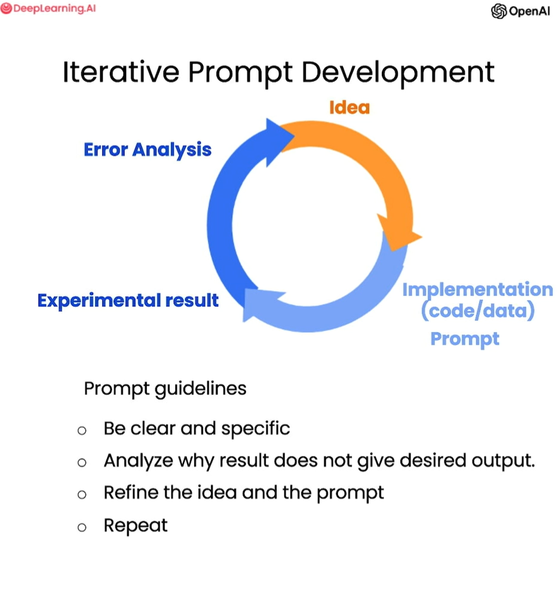

# ChatGPT Prompt Engineering for Developers

Jupyter notebooks cover key concepts and examples, and also include my personal notes and explanations on various topics presented in the following courses:
* [ChatGPT Prompt Engineering for Developers](https://www.deeplearning.ai/short-courses/chatgpt-prompt-engineering-for-developers/)
* [Building Systems with the ChatGPT API](https://www.deeplearning.ai/short-courses/building-systems-with-chatgpt/)

## ChatGPT Prompt Engineering for Developers (notebooks 1-7)
Here you will learn how to use a large language model (LLM) to quickly build new and powerful applications.  Using the OpenAI API, you’ll be able to quickly build capabilities that learn to innovate and create value in ways that were cost-prohibitive, highly technical, or simply impossible before now.

This course taught by Isa Fulford (OpenAI) and Andrew Ng (DeepLearning.AI) will describe how LLMs work, provide best practices for prompt engineering, and show how LLM APIs can be used in applications for a variety of tasks, including:

- Summarizing (e.g., summarizing user reviews for brevity)
- Inferring (e.g., sentiment classification, topic extraction)
- Transforming text (e.g., translation, spelling & grammar correction)
- Expanding (e.g., automatically writing emails)

In addition, you’ll learn two key principles for writing effective prompts, how to systematically engineer good prompts, and also learn to build a custom chatbot. 

## Building Systems With The ChatGPT API (notebooks 8-9
In this course you will learn how to automate complex workflows using chain calls to a large language model. Unlock new development capabilities and improve your efficiency in this brand new short course.

You’ll build:

- Chains of prompts that interact with the completions of prior prompts.
- Systems where Python code interacts with both completions and new prompts.
- A customer service chatbot using all the techniques from this course.

You’ll learn how to apply these skills to practical scenarios, including classifying user queries to a chat agent’s response, evaluating user queries for safety, and processing tasks for chain-of-thought, multi-step reasoning. 

This course, taught by Isa Fulford (OpenAI) and Andrew Ng (DeepLearning.AI), builds on the lessons taught in the popular ChatGPT Prompt Engineering for Developers, though it is not a prerequisite.

